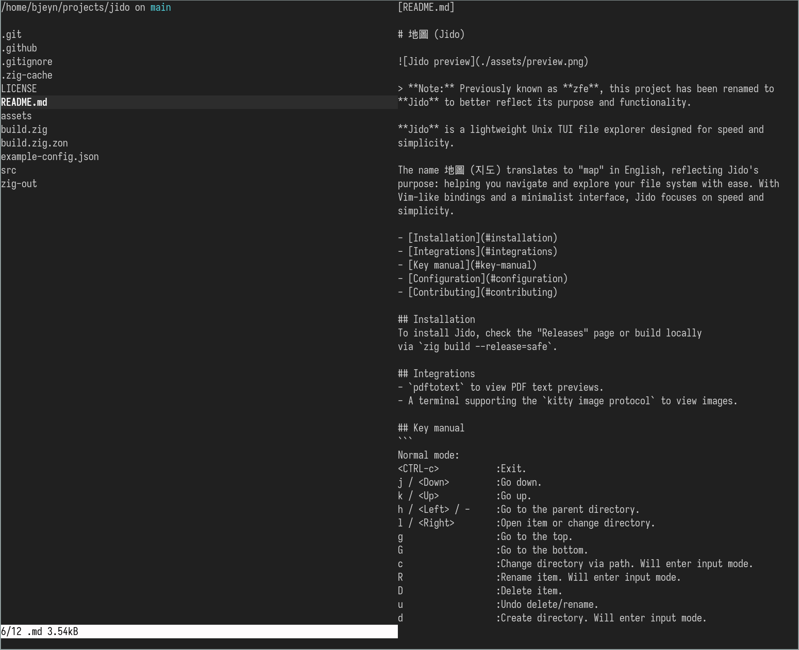

# 地圖 (Jido)



> **Note:** Previously known as **zfe**, this project has been renamed to 
**Jido** to better reflect its purpose and functionality.

**Jido** is a lightweight Unix TUI file explorer designed for speed and 
simplicity.

The name 地圖 (지도) translates to "map" in English, reflecting Jido's 
purpose: helping you navigate and explore your file system with ease. With 
Vim-like bindings and a minimalist interface, Jido focuses on speed and
simplicity.

- [Installation](#installation)
- [Integrations](#integrations)
- [Key manual](#key-manual)
- [Configuration](#configuration)
- [Contributing](#contributing)

## Installation
To install Jido, check the "Releases" page or build locally 
via `zig build --release=safe`.

## Integrations
- `pdftotext` to view PDF text previews.
- A terminal supporting the `kitty image protocol` to view images.

## Key manual
```
Normal mode:
<CTRL-c>           :Exit.
j / <Down>         :Go down.
k / <Up>           :Go up.
h / <Left> / -     :Go to the parent directory.
l / <Right>        :Open item or change directory.
g                  :Go to the top.
G                  :Go to the bottom.
c                  :Change directory via path. Will enter input mode.
R                  :Rename item. Will enter input mode.
D                  :Delete item.
u                  :Undo delete/rename.
d                  :Create directory. Will enter input mode.
%                  :Create file. Will enter input mode.
/                  :Fuzzy search directory. Will enter input mode.
:                  :Allows for Jido commands to be entered. Please refer to the 
                    "Command mode" section for available commands. Will enter 
                    input mode.

Input mode:
<Esc>              :Cancel input.
<CR>               :Confirm input.

Command mode:
:q                 :Exit.
:config            :Navigate to config directory if it exists.
:trash             :Navigate to trash directory if it exists.
:empty_trash       :Empty trash if it exists. This action cannot be undone.
:cd <path>         :Change directory via path. Will enter input mode.
```


## Configuration
Configure `jido` by editing the external configuration file located at either:
- `$HOME/.jido/config.json`
- `$XDG_CONFIG_HOME/jido/config.json`.

Jido will look for these env variables specifically. If they are not set, Jido will
not be able to find the config file.

An example config file can be found [here](https://github.com/BrookJeynes/jido/blob/main/example-config.json).

Config schema:
```
Config = struct {
    .show_hidden: bool,
    .sort_dirs: bool,
    .show_images: bool,
    .preview_file: bool,
    .empty_trash_on_exit: bool,
    .styles: Styles,
}

NotificationStyles = struct {
    box: vaxis.Style,
    err: vaxis.Style,
    warn: vaxis.Style,
    info: vaxis.Style,
};

Styles = struct {
    .selected_list_item: Style,
    .list_item: Style,
    .file_name: Style,
    .file_information: Style
    .notification: NotificationStyles,
    .git_branch: Style,
}

Style = struct {
    .fg: Color,
    .bg: Color,
    .ul: Color,
    .ul_style = .{
        off,
        single,
        double,
        curly,
        dotted,
        dashed,
    }
    .bold: bool,
    .dim: bool,
    .italic: bool,
    .blink: bool,
    .reverse: bool,
    .invisible: bool,
    .strikethrough: bool,
}

Color = enum{
    default,
    index: u8,
    rgb: [3]u8,
}
```

## Contributing
Contributions, issues, and feature requests are always welcome! This project is
currently using the latest stable release of Zig (0.13.0).
